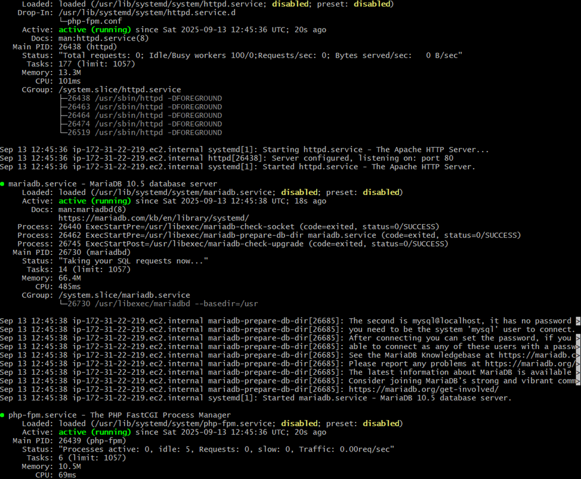
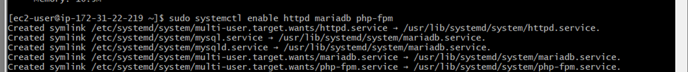
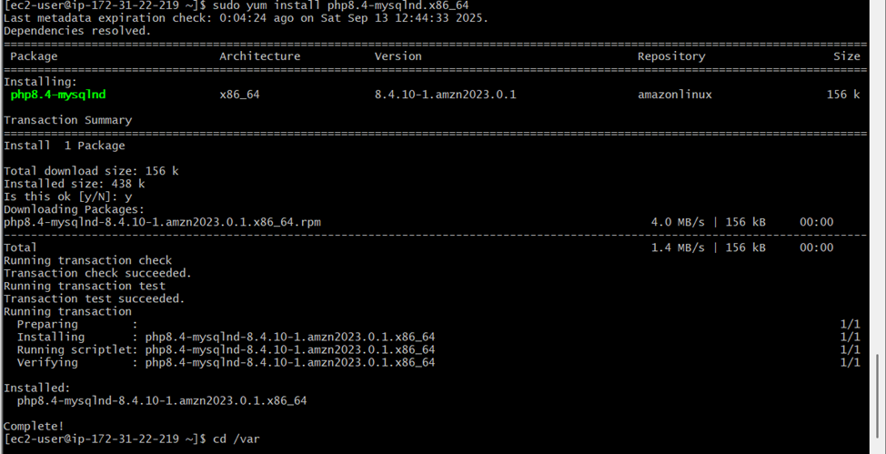
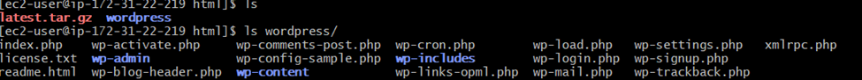
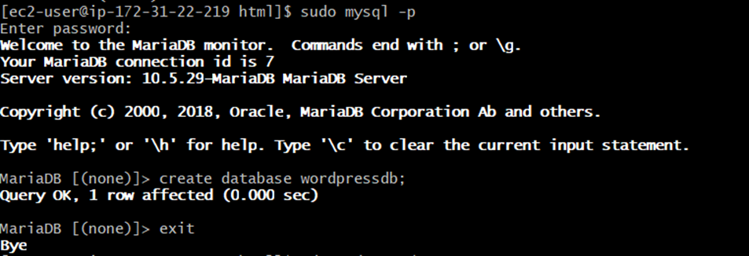
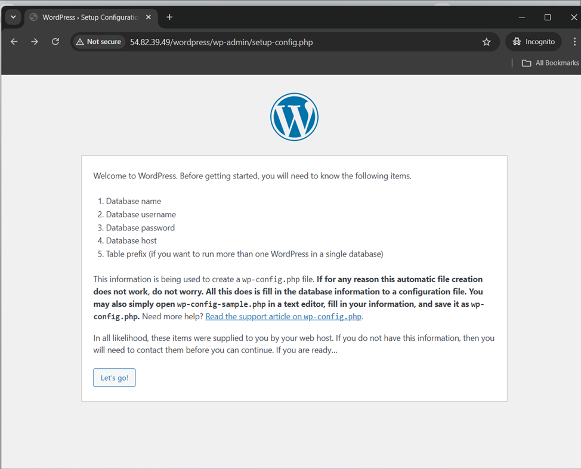
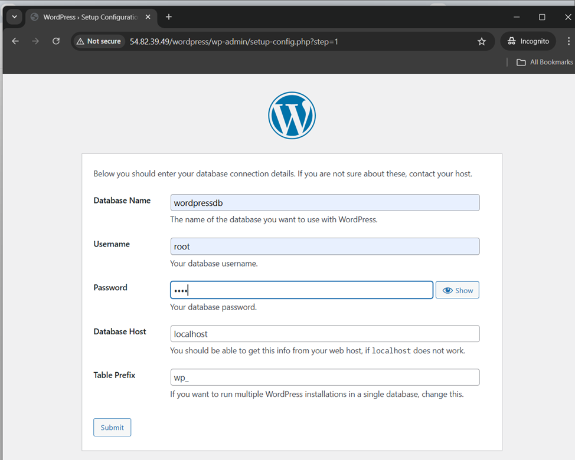
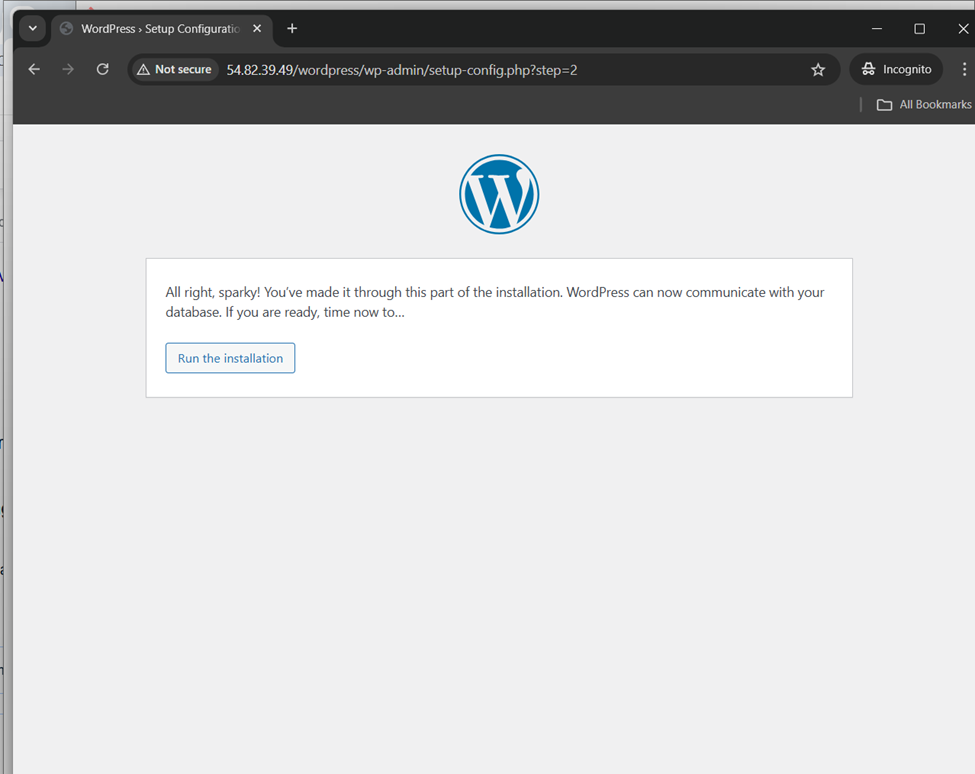
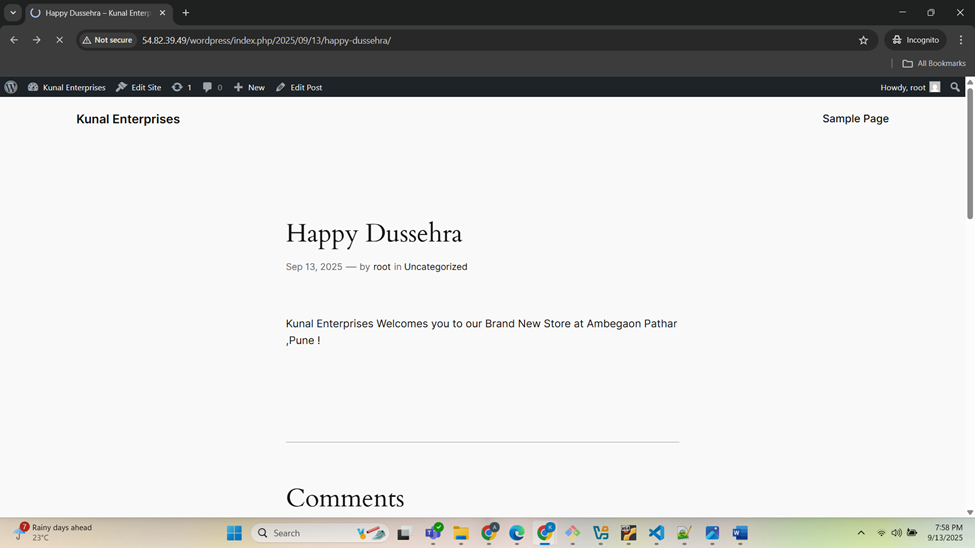
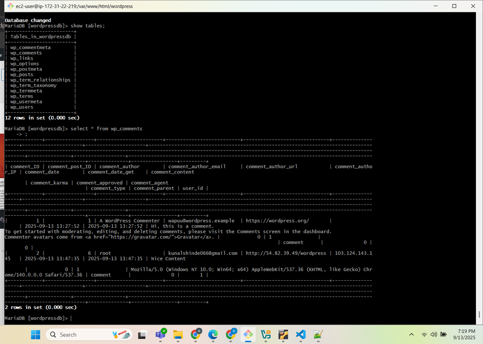

# WordPress Deployment on Amazon Linux  
*"Bringing WordPress to Life on AWS EC2 with Apache, PHP, and MariaDB"*  

---

## Overview  
This project demonstrates how to install and configure **WordPress** on an **Amazon Linux EC2 instance** using **Apache (httpd)**, **PHP**, and **MariaDB**. It covers the complete setup from preparing the server to creating a database and configuring permissions.

---

## Prerequisites  
Before starting, ensure you have:  
- An **Amazon Linux 2 EC2 instance** running  
- **Security groups** allowing inbound traffic on:
  - Port **22 (SSH)**
  - Port **80 (HTTP)**
- A **key pair (.pem)** for SSH access  
- Basic knowledge of Linux commands  

---

## Steps Followed  

### 1. Update System and Install Required Packages  
```bash
sudo yum update -y
sudo yum install httpd mariadb105-server php -y
sudo systemctl start httpd mariadb php-fpm
sudo systemctl status httpd mariadb php-fpm
````



```bash
sudo systemctl enable httpd mariadb php-fpm
```



### 2. Install PHP MySQL Extension

```bash
sudo yum install php8.4-mysqlnd.x86_64 -y
```



### 3. Download and Extract WordPress

```bash
cd /var/www/html
sudo wget https://wordpress.org/latest.tar.gz
sudo tar -xvzf latest.tar.gz
```



### 4. Configure MariaDB Database

Login to MySQL:

```bash
sudo mysql -p
```

Inside MySQL run:

```sql
CREATE DATABASE wordpressdb;
ALTER USER 'root'@'localhost' IDENTIFIED BY 'password';
```


Exit MySQL.

### 5. Set Permissions for the WordPress Directory

```bash
cd wordpress/
sudo chown -R apache:apache /var/www/html/wordpress
```

### 6. WordPress and Database Connectivity

Visit your site using public and follow below steps.

```
http://<your-ec2-public-ip>/wordpress
```

6.1 Click on **Let’s go!**



6.2 Enter the Database Name you created along with the username and password.


6.3 If you see this confirmation screen, you’re good to go!


### 7. Restart Services and Verify

```bash
sudo systemctl restart httpd mariadb php-fpm
sudo systemctl status httpd mariadb php-fpm
```

### 8. Customize Your Website

8.1 I added a simple post for Dussehra. You can create your own posts with images and URLs.


---

### 9. Check Data Insertion and Retrieval

9.1 I added a comment on my post using the same root user.


9.2 To verify the data in the database:

```bash
## Switch to the database you created
use wordpressdb;

## Show all tables in the database
show tables;

## Check our comment
select * from comments;
```



---

## Result

WordPress is now installed on your Amazon Linux EC2 instance and fully functional. You can complete the setup by visiting:

```
http://<your-ec2-public-ip>/wordpress
```

---

## Tech Stack

* **Amazon Linux 2 (EC2)**
* **Apache (httpd)**
* **MariaDB 10.5**
* **PHP 8.4 + MySQL extension**
* **WordPress**

---

## Summary

In this project, we deployed **WordPress** on Amazon Linux using **Apache**, **MariaDB**, and **PHP**. This walkthrough covers the full process — from installing packages and creating a database to configuring permissions and setting up WordPress for its initial use.

---

## Contact

If you face any issues or have questions, feel free to reach out to me:

* **Email:** [kunalshinde066@gmail.com](mailto:kunalshinde066@gmail.com)
* **LinkedIn:** [https://www.linkedin.com/in/kunal-shinde-1b17a2205/]
